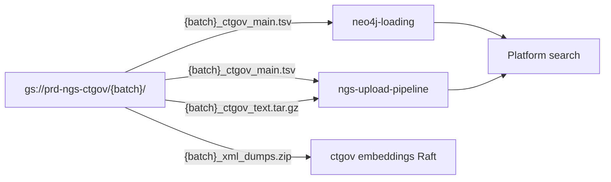

# Outputs and Downstream Consumers

What the pipeline produces, where it lands, and who consumes it.

---

## GCS output layout

All outputs are uploaded to **`gs://prd-ngs-ctgov/{batch}/`** where `{batch}` is the 8-digit `YYYYMMDD` batch_gen value.

| Object | Source | Purpose |
|--------|--------|---------|
| `{batch}_xml_dumps.zip` | Archived CT.gov XML download | Input archive; also consumed by modern `ctgov` embeddings pipeline |
| `{batch}_logs/` | Per-step log files (`01.log` … `11.log`) | Debugging and audit |
| `Intermediate_steps/` | All intermediate TSVs (`CT_{batch}_01.tsv` … `CT_{batch}_10.tsv`) | Step-by-step artifacts for investigation |
| `{batch}_ctgov_main.tsv` | Copy of `CT_{batch}_09.tsv` | **Canonical evidence file** for Neo4j + BigQuery |
| `{batch}_ctgov_text.tar.gz` | Archived `txt-files/` directory | NGS abstract text files for search indexing |

Upload is performed by `run_ct.sh` using `gcloud_service_account.json`.

---

## `{batch}_ctgov_main.tsv` — evidence contract

The main output file. **125 columns total:** 121 from step 06 aggregation, plus `ngs_score`, `article_title_evidence_tag`, and `final_ngs_score` from step 07, plus `final_aggregated_title_tagged` from step 08. Step 09 fills the existing `article_mesh_terms` column (created in step 06) rather than appending new columns.

### Key fields

| Field | Value | Meaning |
|-------|-------|---------|
| `data_source` | `8` | ClinicalTrials.gov source ID in Causaly's data source registry |
| `article_type` | `3` | Clinical trial article type |
| `article_uuid` | `{nct_id}_{batch_gen}_{parse_version}` | Unique trial batch identifier |
| `primary_id` | `{nct_id}` | ClinicalTrials.gov trial ID (already `NCT…`-prefixed) |
| `connective_type` | `OBSERVATION` | Evidence relationship type |
| `sem_type` | `UNIDIRECTIONAL` | Cause→effect directionality |
| `cause_*` | intervention fields | Intervention mapped as **cause** |
| `effect_*` | condition fields | Condition mapped as **effect** |
| `batch_generation` | `{batch_gen}` | Release batch date |
| `parse_version` | `0.6` | Pipeline code version |
| `article_mesh_terms` | MeSH term names | From step 09 CUI→MeSH mapping |
| `ngs_score` / `final_ngs_score` | float | NGS evidence scoring from step 07 |
| `final_aggregated_title_tagged` | string | Aggregated concept-tagged title from step 08 |

Default missing value: `'0'` (required by Neo4j import).

### Row semantics

Each row is one **condition × intervention** evidence relationship for a clinical trial. A trial with 2 conditions and 3 interventions produces up to 6 rows (after deduplication in step 05).

---

## Downstream consumers

### neo4j-loading

| | |
|---|---|
| **Config** | `neo4j-loading/config_prod.yaml` → bucket `ctgov: "prd-ngs-ctgov"` |
| **Download** | `orchestration/stages/configure_server_stage.py` → `_download_ctgov_file()` pulls `{batch}/{batch}_ctgov_main.tsv` |
| **Load** | `orchestration/stages/loading_stage.py` → loads `file:///{batch_dir}/{batch_date}_ctgov_main.tsv` |
| **Import path** | `/var/lib/neo4j/import/{batch}_to_load/{batch}_ctgov_main.tsv` |

Clinical trial evidence enters the knowledge graph as cause→effect relationships with `data_source=8`.

### ngs-upload-pipeline

| | |
|---|---|
| **Evidence** | Argo step `ngs_upload_evidence_ct` loads `{batch}_ctgov_main.tsv` → `causaly-demo.pg06_{batch}.evidence_ct` |
| **Abstracts** | Argo step `nct_abstracts_process` extracts `{batch}_ctgov_text.tar.gz` → `causaly-demo.pg06_{batch}.abstracts_nct` |
| **Further processing** | `article_ct` view in lifecycle-management → `article_metadata_primary_index` → NGS ES upload |

See [dast-toolbox wiki: search-serving](https://github.com/causaly/dast-toolbox/blob/main/wiki/domains/search-serving.md) and [data-lifecycle](https://github.com/causaly/dast-toolbox/blob/main/wiki/cross-cutting/data-lifecycle.md) for the full NGS batch flow.

### ctgov (modern embeddings pipeline)

| | |
|---|---|
| **Raft config** | `ctgov/ctgov_pipeline.yaml` |
| **Action** | `move-ctgov-files` copies `{batch}_xml_dumps.zip` from `prd-ngs-ctgov` → `prd-causaly-cloud-data-sources` |
| **Purpose** | Feeds the modern CT.gov embeddings pipeline (separate from this core evidence pipeline) |
| **Service account** | `prd-ct-gov-pipeline@causaly-prd-pipeline.iam.gserviceaccount.com` |

---

## Release stats — CTgov run log

After each pipeline run, update the [CTgov run log](https://causaly.atlassian.net/wiki/spaces/DaST/pages/409698422) Confluence page with values from `{batch}_stats.txt`.

**Do not duplicate the full stats table in repo docs** — the Confluence page is the living record. Link to it and document how to update it.

### Stats file generation

`run_ct.sh` creates `{batch}_stats.txt` by:
1. Appending the last 4 lines of the step 01 extraction log (includes `Articles with neither condition nor intervention`)
2. Running [`misc/CT_stats.py`](../misc/CT_stats.py) on `{batch}_ctgov_main.tsv`

### Column meanings

| Column (Confluence) | Source in `{batch}_stats.txt` | Meaning |
|---------------------|--------------------------------|---------|
| **Release** | Manual | Batch date (`YYYYMMDD`) — the `batch_gen` value |
| **Delta of loaded trials** | Manual | New trials since previous release (compare `Number of uploaded documents` across runs) |
| **Number of not uploaded documents** | `Articles with neither condition nor intervention` (from step 01 log tail in stats file) | Trials with no extractable condition and no extractable intervention |
| **Number of uploaded documents** | `Number of uploaded documents` | Unique `article_uuid` count (one per trial) |
| **Total number of rows** | `Total number of rows` | Total evidence rows in main TSV |
| **Number of extracted relationships** | `Number of extracted relationships (i.e., with both interventions and indications)` | Rows with both cause and effect CUIs recognized |
| **Number relationships with non recognized entities** | `Number relationships with non recognized entities` | Rows where neither cause nor effect CUI is mapped |
| **Number relationships with recognized Intervention only** | `Number relationships with recognized Intervention only` | Only cause (intervention) CUI mapped |
| **Number relationships with recognized Indication only** | `Number relationships with recognized Indication only` | Only effect (condition) CUI mapped |
| **Number of unique recognized entities (Interventions)** | `Number of unique recognized entities (Interventions)` | Distinct intervention CUIs |
| **Number of unique recognized entities (Indications)** | `Number of unique recognized entities (Indications)` | Distinct condition CUIs |
| **Documents processing Errors** | Manual | Usually `0` unless extraction errors occurred |
| **Version** | Manual | Format: `{cutoff_date}::{UMLS_version}::{code_version}` e.g. `20260521::2023AB_custom2025AB::v1.0.1`. The run-log code version is maintained separately from pipeline `parse_version` (`0.6` in `run_ct.sh`).

### Update procedure (each release)

1. Run `./run_ct.sh YYYYMMDD`
2. Read `{batch}_stats.txt` from the repo root
3. Add a new row to the [CTgov run log](https://causaly.atlassian.net/wiki/spaces/DaST/pages/409698422) table
4. Fill in stats columns from the stats file
5. Compute delta of loaded trials vs previous release's "Number of uploaded documents"
6. Set the Version column manually using the Confluence convention (e.g. `20260521::2023AB_custom2025AB::v1.0.1`). Do not derive it from `parse_version`.
