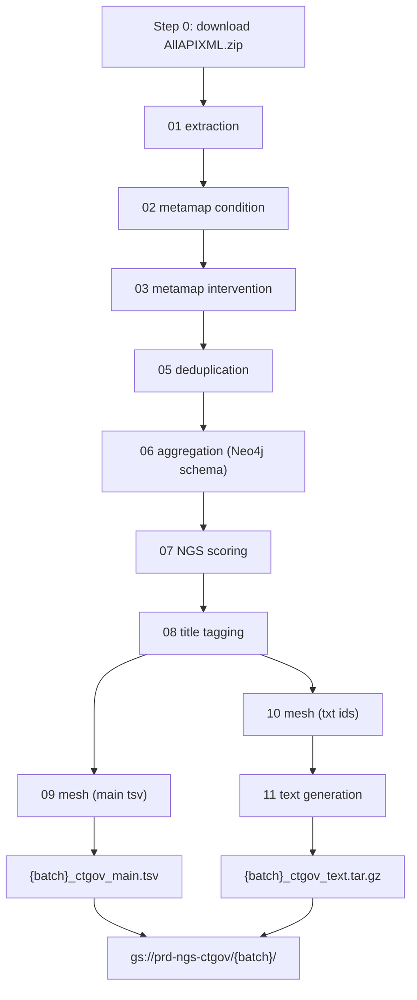

# ClinicalTrials.gov Core Pipeline

Batch pipeline that downloads ClinicalTrials.gov XML, maps conditions and interventions to UMLS concepts via MetaMap, aggregates evidence for the knowledge graph, scores for NGS search, and produces text abstracts for indexing.

**Entry point:** `./run_ct.sh YYYYMMDD` (runs on production VM `prd-pipeline-ct-gov`)

---

## Data Source

Full XML archive from ClinicalTrials.gov:

```
https://classic.clinicaltrials.gov/AllAPIXML.zip
```

Each release is versioned by an 8-digit batch date (`YYYYMMDD`, e.g. `20260517`).

---

## Pipeline Flow



Steps 01, 09–11 use Python 3. Steps 02–08 use Python 2.7. Step 04 (COVID replacement) is deprecated and not run.

---

## Documentation

| Document | Purpose |
|----------|---------|
| [pipeline-steps.md](pipeline-steps.md) | Detailed per-step reference (scripts, inputs, outputs, logic) |
| [running-the-pipeline.md](running-the-pipeline.md) | VM run procedure, prerequisites, troubleshooting |
| [umls-update.md](umls-update.md) | UMLS release update procedure (MetaMap, dictionaries, MeSH) |
| [outputs-and-downstream.md](outputs-and-downstream.md) | GCS layout, evidence contract, downstream consumers, release stats |

### Confluence (operational)

| Page | Purpose |
|------|---------|
| [Run pipeline (step by step)](https://causaly.atlassian.net/wiki/spaces/DaST/pages/2710372353/Run+pipeline+step+by+step) | Quick operational runbook |
| [UMLS update process](https://causaly.atlassian.net/wiki/spaces/DaST/pages/2710142978/UMLS+update+process) | UMLS update with BIS QA workflow |
| [CTgov run log](https://causaly.atlassian.net/wiki/spaces/DaST/pages/409698422) | Release stats table (update after each run) |

---

## Key Versions

| Component | Current value |
|-----------|---------------|
| MetaMap UMLS (`-Z`) | `2023AB` |
| MetaMap custom vocab (`-V`) | `custom2025AB` |
| NGS scoring pickles | `/tools/metathesaurus_files/2025AB_data/` |
| CUI→MeSH pickle | `cui2mesh_2025AB_merged_2023AB.pkl` |
| Parse version | `0.6` |
| Data source ID | `8` (ClinicalTrials.gov) |

---

## Outputs

| Artifact | GCS path | Consumer |
|----------|----------|----------|
| `{batch}_ctgov_main.tsv` | `gs://prd-ngs-ctgov/{batch}/` | neo4j-loading, ngs-upload-pipeline (`evidence_ct`) |
| `{batch}_ctgov_text.tar.gz` | `gs://prd-ngs-ctgov/{batch}/` | ngs-upload-pipeline (`abstracts_nct`) |
| `{batch}_xml_dumps.zip` | `gs://prd-ngs-ctgov/{batch}/` | ctgov embeddings Raft pipeline |

See [outputs-and-downstream.md](outputs-and-downstream.md) for the full output contract and downstream handoff.

---

## Quick Start (on VM)

```bash
cd /home/m.kyriakakis/ctgov-core-pipeline
screen -S CT
chmod +x run_ct.sh
./run_ct.sh 20260517
```

See [running-the-pipeline.md](running-the-pipeline.md) for prerequisites and the full procedure.
